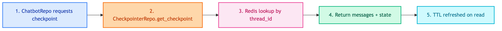
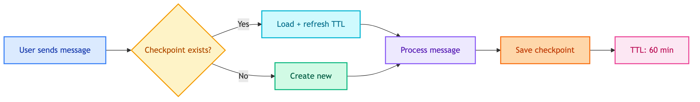

# **⏱️ Checkpointer Repositories**

Short-term conversation memory with TTL-based expiration.


---


## **📍 Location**

[`src/repositories/checkpointers/`](../../../../src/repositories/checkpointers/)


---


## **📋 Overview**

Checkpointers store LangGraph state per thread. Used for:
- Conversation continuity within a session
- Message history for context
- State persistence between turns


---


## **🔄 Code Flow**




---


## **🎯 Base Interface**

```python
class BaseCheckpointerRepository(ABC):
    @property
    @abstractmethod
    def checkpointer(self) -> BaseCheckpointSaver:
        """Get underlying checkpointer for workflow injection."""
        pass

    @abstractmethod
    def get_checkpoint(self, thread_id: str) -> Optional[CheckpointTuple]:
        pass

    @abstractmethod
    def delete_checkpoint(self, thread_id: str) -> None:
        pass
```


---


## **📦 Implementations**

| | |
|:---:|:---:|
| [🔴 **RedisCheckpointerRepository**](redis/main.md)<br/>Redis storage | 🧪 **MemoryCheckpointerRepository**<br/>In-memory (for testing) |


---


## **⏱️ TTL Behavior**



| Scenario | Behavior |
|----------|----------|
| User active | TTL refreshes on each message |
| User inactive 60 min | Checkpoint expires, cleared from Redis |
| Expired + new message | Fresh conversation starts |
