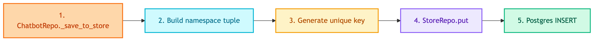

# **💾 Store Repositories**

Long-term conversation memory with permanent storage.


---


## **📍 Location**

[`src/repositories/stores/`](../../../../src/repositories/stores/)


---


## **📋 Overview**

Stores persist conversation data permanently. Used for:
- Backup when checkpointer TTL expires
- Cross-thread data access
- Audit and compliance
- Analytics


---


## **🔄 Code Flow**




---


## **🎯 Base Interface**

```python
class BaseStoreRepository(ABC):
    @property
    @abstractmethod
    def store(self) -> BaseStore:
        """Get underlying store for workflow injection."""
        pass

    @abstractmethod
    def put(self, namespace: tuple, key: str, value: dict) -> None:
        pass

    @abstractmethod
    def get(self, namespace: tuple, key: str) -> Optional[dict]:
        pass

    @abstractmethod
    def search(self, namespace: tuple, query: str = None, limit: int = 10) -> list[dict]:
        pass

    @abstractmethod
    def delete(self, namespace: tuple, key: str) -> None:
        pass
```


---


## **📦 Implementations**

| | |
|:---:|:---:|
| [🐘 **PostgresStoreRepository**](postgres/main.md)<br/>PostgreSQL storage | |


---


## **📂 Namespace Structure**

Namespaces are hierarchical tuples (like folders):

```
("users", user_id, "conversations")
   │        │           │
   │        │           └── Data type
   │        └── User identifier
   └── Top-level category
```


---


## **🔑 Key Structure**

```
thread-123_20241227_143000_abc12345
   │           │       │      │
   │           │       │      └── UUID (uniqueness)
   │           │       └── Time (HHMMSS)
   │           └── Date (YYYYMMDD)
   └── Thread ID
```


---


## **🎯 When to Use**

| Use Case | How |
|----------|-----|
| Resume old conversation | `search(namespace)` → get messages → inject to new thread |
| Audit log | `search(namespace)` → export |
| Analytics | Query PostgreSQL directly |
