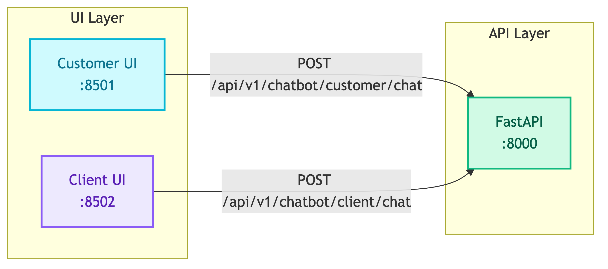

# **🖥️ UI Layer**

Streamlit web interfaces for interacting with the chatbot system.


---


## **📋 Overview**

The UI layer provides two separate Streamlit applications:
- **Customer UI** - Customer support chatbot for product inquiries and orders
- **Client UI** - BI analytics chatbot for business users


---


## **🏗️ Architecture**

```
ui/
├── __init__.py
├── customer_app.py    # Customer support chatbot
└── client_app.py      # BI analytics chatbot
```


---


## **📦 Applications**

| | |
|:---:|:---:|
| [👤 **Customer App**](customer_app.md)<br/>Port 8501 - End customers | [💼 **Client App**](client_app.md)<br/>Port 8502 - Business analysts |


---


## **🔧 Technology Stack**

- **Streamlit** - Python web app framework
- **Requests** - HTTP client for API calls


---


## **🔄 Flow**




---


## **💾 Session Management**

Both apps use Streamlit session state:

| State Key | Type | Purpose |
|-----------|------|---------|
| `messages` | list | Chat history |
| `session_started` | bool | Session active flag |
| `thread_id` | str | Conversation thread ID |
| `user_id` | str | User identifier |


---


## **🚀 Running Locally**

```bash
# Customer UI
streamlit run ui/customer_app.py --server.port 8501

# Client UI
streamlit run ui/client_app.py --server.port 8502
```


---


## **🐳 Docker**

See [Docker UI Services](../../infrastructure/docker/ui.md) for container configuration.
