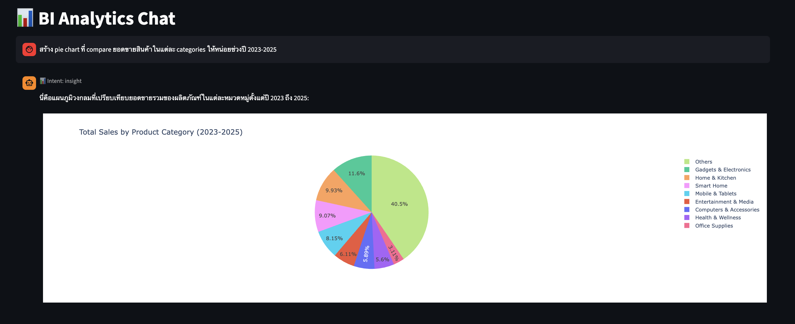
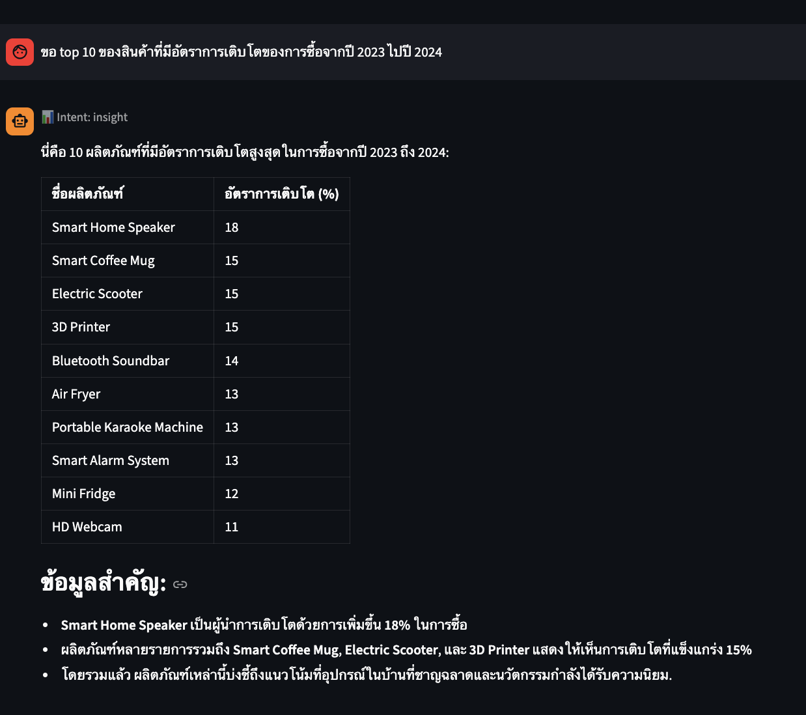
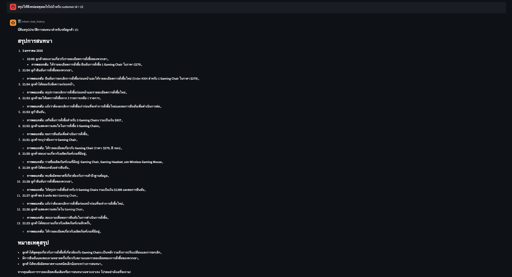

# **💼 Client App**

Streamlit UI for BI analytics chatbot.


---


## **📍 Location**

[`ui/client_app.py`](../../../ui/client_app.py)


---


## **🌐 Port**

`8502`


---


## **✨ Features**

- Sales analytics
- Customer insights
- Product statistics
- Data visualization (Plotly charts)
- Customer chat history lookup
- Thai/English support


---


## **📸 Screenshots**


### 📊 **Analytics with Chart**


### 📋 **Analytics without Chart**




### 💬 **Customer Chat Lookup**




---


## **🔗 API Endpoint**

```
POST /api/v1/chatbot/client/chat
```


### 📤 **Request**

```json
{
  "query": "Show me this month's sales",
  "thread_id": "abc123",
  "user_id": "analyst_001"
}
```


### 📥 **Response**

```json
{
  "response": "This month's total sales is $125,000...",
  "thread_id": "abc123",
  "intent": "INSIGHT",
  "chart_html": "<div>...</div>"
}
```


---


## **📊 Session State**

| Key | Type | Default | Purpose |
|-----|------|---------|---------|
| `messages` | list | `[]` | Chat history (includes chart_html) |
| `session_started` | bool | `False` | Session active |
| `thread_id` | str | `""` | Conversation ID |
| `user_id` | str | `""` | Analyst ID |


---


## **📈 Chart Rendering**

Charts are rendered using `streamlit.components.v1.html()`:

```python
if result.get("chart_html"):
    components.html(result["chart_html"], height=500, scrolling=True)
```


---


## **🎯 Intent Display**

The UI shows intent classification from orchestrator:

| Intent | Description |
|--------|-------------|
| `INSIGHT` | BI analytics query |
| `CHAT_HISTORY` | Customer chat lookup |


---


## **❌ Error Handling**

| Error | Message |
|-------|---------|
| Connection Error | Cannot connect to API Server |
| Timeout | Connection timed out |
| Other | Error: {error} |


---


## **⚙️ Configuration**

| Variable | Source | Default |
|----------|--------|---------|
| `API_BASE_URL` | Environment | `http://localhost:8000` |
| Request Timeout | Hardcoded | 120 seconds |
