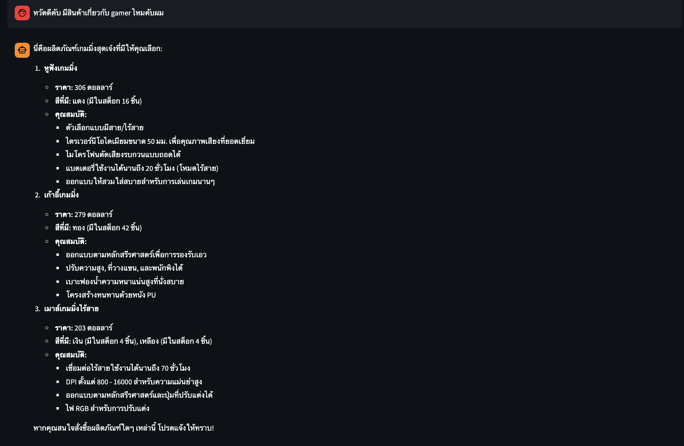
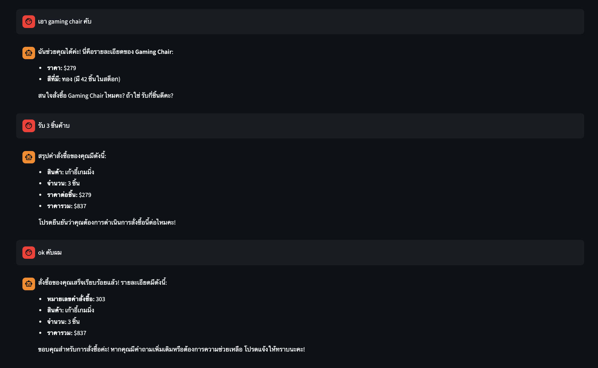
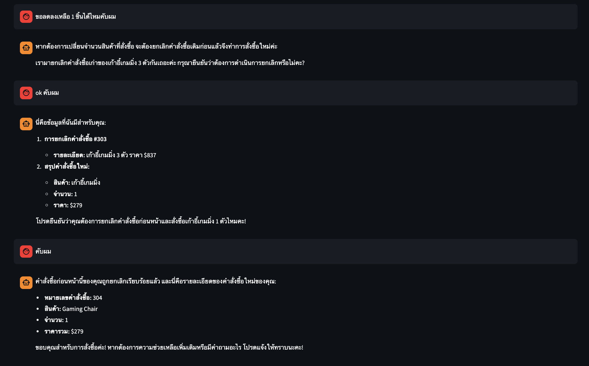
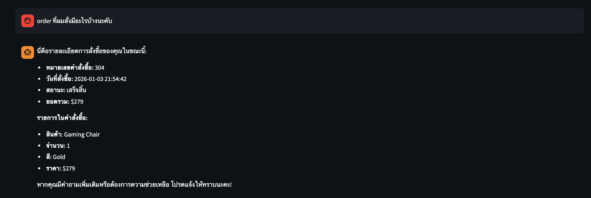

# **👤 Customer App**

Streamlit UI for customer support chatbot.


---


## **📍 Location**

[`ui/customer_app.py`](../../../ui/customer_app.py)


---


## **🌐 Port**

`8501`


---


## **✨ Features**

- Product search
- Stock inquiries
- Price checks
- Order placement
- Order cancellation
- Thai/English support


---


## **📸 Screenshots**


### 🔍 **Product Search**




### 📦 **Place Order**




### ❌ **Cancel Order**




### 📋 **View Orders**




---


## **🔗 API Endpoint**

```
POST /api/v1/chatbot/customer/chat
```


### 📤 **Request**

```json
{
  "query": "Do you have gaming products?",
  "thread_id": "abc123",
  "user_id": "customer_001"
}
```


### 📥 **Response**

```json
{
  "response": "Found Gaming Chair and Gaming Headphones...",
  "thread_id": "abc123"
}
```


---


## **📊 Session State**

| Key | Type | Default | Purpose |
|-----|------|---------|---------|
| `messages` | list | `[]` | Chat history |
| `session_started` | bool | `False` | Session active |
| `thread_id` | str | `""` | Conversation ID |
| `user_id` | str | `""` | Customer ID |


---


## **❌ Error Handling**

| Error | Message |
|-------|---------|
| Connection Error | Cannot connect to API Server |
| Timeout | Connection timed out |
| Other | Error: {error} |


---


## **⚙️ Configuration**

| Variable | Source | Default |
|----------|--------|---------|
| `API_BASE_URL` | Environment | `http://localhost:8000` |
| Request Timeout | Hardcoded | 120 seconds |
