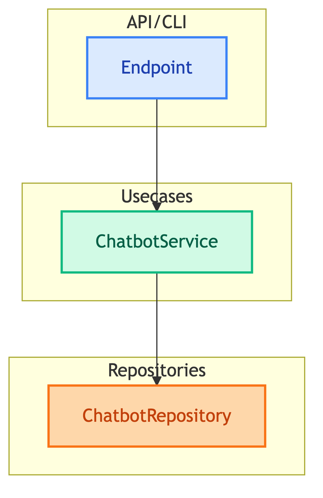

# **💼 Usecases**

Application business logic layer.


---


## **📍 Location**

[`src/usecases/`](../../../src/usecases/)


---


## **📋 Overview**

Usecases orchestrate repositories to implement business operations. They are thin wrappers that delegate to repositories.




---


## **📦 Available Usecases**

| | |
|:---:|:---:|
| [🤖 **ChatbotService**](chatbot_service.md)<br/>Generic chatbot operations | |


---


## **❓ Why Usecase Layer?**

| Benefit | Description |
|---------|-------------|
| Abstraction | API doesn't know about repository internals |
| Testability | Easy to mock for unit tests |
| Extensibility | Add business logic without changing API/repo |


---


## **📂 File Structure**

```
src/usecases/
├── __init__.py
└── chatbot/
    ├── __init__.py
    └── main.py              # ChatbotService
```


---


## **🔗 References**

- [Repositories](../repositories/README.md) - Data access layer
- [Dependencies](../dependencies/README.md) - DI wiring
