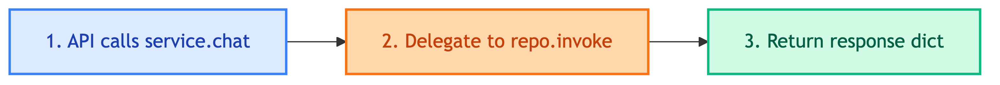

# **🤖 ChatbotService**

Generic chatbot service that works with any chatbot repository.


---


## **📍 Location**

[`src/usecases/chatbot/main.py`](../../../src/usecases/chatbot/main.py)


---


## **💡 Purpose**

Thin wrapper that delegates to `BaseChatbotRepository`. Provides unified interface for API/CLI layers.


---


## **🔄 Code Flow**




---


## **📋 Class Definition**

```python
class ChatbotService:
    def __init__(self, chatbot_repo: BaseChatbotRepository):
        self._repo = chatbot_repo

    def chat(self, query, thread_id, user_id) -> dict
    def get_history(self, thread_id) -> list[BaseMessage]
    def clear_conversation(self, thread_id) -> None
```


---


## **🔧 Methods**

| Method | Input | Output | Description |
|--------|-------|--------|-------------|
| chat | query, thread_id, user_id | dict | Process chat query |
| get_history | thread_id | list[BaseMessage] | Get conversation history |
| clear_conversation | thread_id | None | Clear conversation memory |


---


## **🔗 Repository Reference**

| Repository | Documentation |
|------------|---------------|
| BaseChatbotRepository | [repositories/chatbots/base.md](../repositories/chatbots/base.md) |
| ClientChatbotRepository | [repositories/chatbots/client/main.md](../repositories/chatbots/client/main.md) |
| CustomerChatbotRepository | [repositories/chatbots/customer/main.md](../repositories/chatbots/customer/main.md) |


---


## **💡 Usage**

```python
from src.dependencies.customer_chatbot import build_chatbot_service

# Build service with all dependencies wired
service = build_chatbot_service()

# Chat
result = service.chat(
    query="หาลำโพง bluetooth",
    thread_id="thread-123",
    user_id="user-456",
)
print(result["response"])

# Get history
messages = service.get_history("thread-123")

# Clear conversation
service.clear_conversation("thread-123")
```
