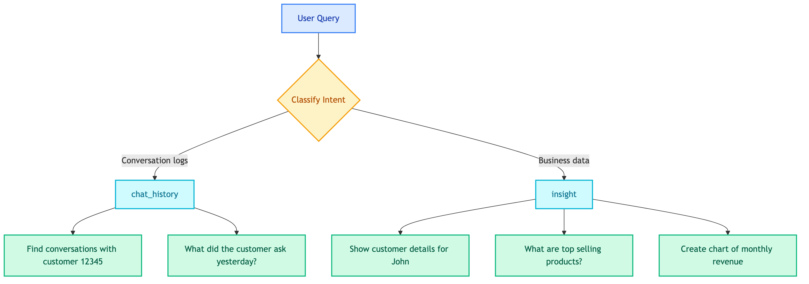

# **🔀 Orchestrator Prompt**

Route client queries to appropriate agents.

---

## **📍 Location**

[`prompts/agents/client/orchestrator.prompt`](../../../../prompts/agents/client/orchestrator.prompt)

---

## **🏷️ Prompt Name**

`client_chatbot_orchestrator`

---

## **💡 Purpose**

Classify user intent to route to either `chat_history` or `insight` agent.

---

## **📥 Input Variables**

| Variable | Description |
|----------|-------------|
| `current_datetime` | Current date/time |
| `timezone` | Current timezone |

---

## **📤 Output**

Single word: `chat_history` or `insight`

---

## **📊 Categories**

| Category | When to Use | Examples |
|----------|-------------|----------|
| `chat_history` | Search conversation logs | "Find conversations with customer ID 12345" |
| `insight` | Query business data, analytics, reports | "Show sales by region", "Customer profile" |

---

## **📝 Key Rules**

- Queries about customer **profiles, orders, business data** → `insight`
- Queries about **chat conversation history** → `chat_history`
