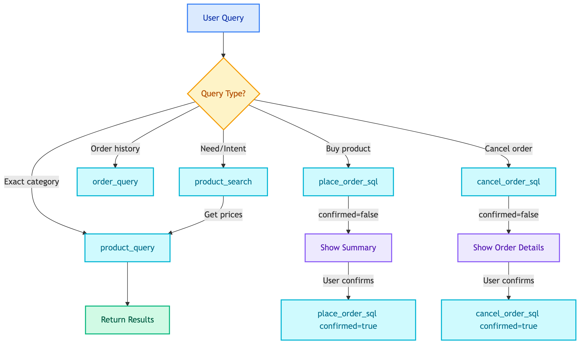

# **🛒 Product Agent Prompt**

System prompt for customer shopping assistant.

---

## **📍 Location**

[`prompts/agents/customer/product_agent.prompt`](../../../../prompts/agents/customer/product_agent.prompt)

---

## **🏷️ Prompt Name**

`product_agent`

---

## **💡 Purpose**

Guide the LLM to handle product queries, orders, and cancellations for customers.

---

## **📥 Input Variables**

| Variable | Description |
|----------|-------------|
| `current_datetime` | Current date/time |
| `timezone` | Current timezone |

---

## **🔧 Tools Available**

| Tool | Purpose |
|------|---------|
| `product_search` | Semantic search for products |
| `similar_products` | Find similar products by ID |
| `product_query` | SQL query for prices, stock |
| `order_query` | Query customer's order history |
| `place_order_sql` | Place new order |
| `cancel_order_sql` | Cancel existing order |

---

## **🔄 Workflow**

---

## **📝 Key Rules**

### 🔧 **Tool Selection**

| User Says | Use Tool | Reason |
|-----------|----------|--------|
| "I need something for smart home" | `product_search` | Intent/need based |
| "Show products in Smart Home category" | `product_query` | Exact category |
| "What's the price of X?" | `product_query` | Price query |
| "I want to order Gaming Chair" | `place_order_sql` | Order request |
| "Cancel my order" | `cancel_order_sql` | Cancel request |

### 📦 **Order Flow**

1. Call `place_order_sql` with `confirmed=false` → Get summary
2. Show summary to user
3. Wait for confirmation ("yes", "ใช่", "confirm")
4. Call `place_order_sql` with `confirmed=true` → Execute

### ❌ **Cancel Flow**

1. Call `cancel_order_sql` with `confirmed=false` → Get order details
2. Show details to user
3. Wait for confirmation
4. Call `cancel_order_sql` with `confirmed=true` → Execute

### ✏️ **Modify Order (Change Quantity)**

No direct modification supported:
1. Cancel existing order
2. Place new order with updated quantity

### 🚨 **Critical Rules**

> ⚠️ **Important:** Follow these rules to avoid errors and privacy violations.

- **NEVER guess colors** - Always query Inventory table
- **NEVER access other customers' data** - Privacy protection
- **order_id ≠ product_id** - Use correct ID for each tool
- **Always query prices** - product_search doesn't return prices
