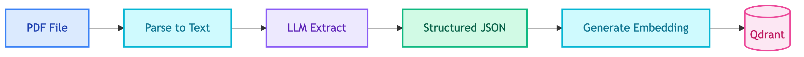

# **📄 Extract Product Prompt**

Extract structured product information from PDF text.


---


## **📍 Location**

[`prompts/ingestor/extract_product.prompt`](../../../prompts/ingestor/extract_product.prompt)


---


## **🏷️ Prompt Name**

`ingestor_extract_product`


---


## **💡 Purpose**

Extract structured product data from raw PDF text for ingestion into vector database.


---


## **📥 Input Variables**

| Variable | Description |
|----------|-------------|
| `text` | Raw text from PDF |
| `product_id` | Product ID from filename |


---


## **📤 Output Format**

```json
{
  "product_name": "Gaming Chair",
  "description": "Ergonomic gaming chair...",
  "specifications": {
    "weight": "15kg",
    "dimensions": "..."
  },
  "features": [
    {"title": "Lumbar Support", "description": "..."}
  ]
}
```


---


## **🔄 Flow**




---


## **💡 Usage**

Used by `ingestor/pipeline.py` to process product PDFs into Qdrant.
