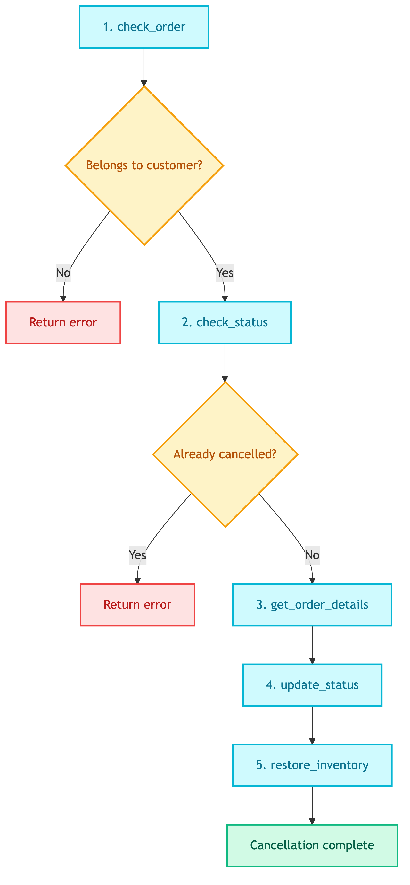

# **❌ Cancel Order SQL Prompt**

Generate SQL statements for cancelling customer orders.


---


## **📍 Location**

[`prompts/tools/customer/cancel_order_sql.prompt`](../../../../prompts/tools/customer/cancel_order_sql.prompt)


---


## **🏷️ Prompt Name**

`tools_customer_cancel_order_sql`


---


## **💡 Purpose**

Generate SQL statements to:
1. Verify order ownership
2. Check order status
3. Get order details for inventory restoration
4. Update status to cancelled
5. Restore inventory quantities


---


## **📥 Input Variables**

| Variable | Description |
|----------|-------------|
| `order_id` | Order ID to cancel |
| `customer_id` | Customer requesting cancellation |
| `schema` | Database schema |
| `db_type` | sqlite or postgresql |


---


## **📤 Output Format**

```json
{
  "check_order": "SELECT ... WHERE order_id = X AND customer_id = Y",
  "check_status": "SELECT status FROM Orders WHERE ...",
  "get_order_details": "SELECT product_id, quantity, color FROM OrderDetails WHERE ...",
  "update_status": "UPDATE Orders SET status = 'cancelled' WHERE ...",
  "restore_inventory": "UPDATE Inventory SET quantity = quantity + ..."
}
```


---


## **🔄 Flow**

<details>
<summary>📊 Flow</summary>



</details>


---


## **📝 Key Rules**

| Rule | Description |
|------|-------------|
| Security | MUST verify customer_id ownership |
| Color matching | Restore to same color inventory row |
| SUM quantity | Handle multiple OrderDetails rows |
| NULL handling | Handle NULL color values |

> ⚠️ **Important:** Always verify order ownership before cancellation.
