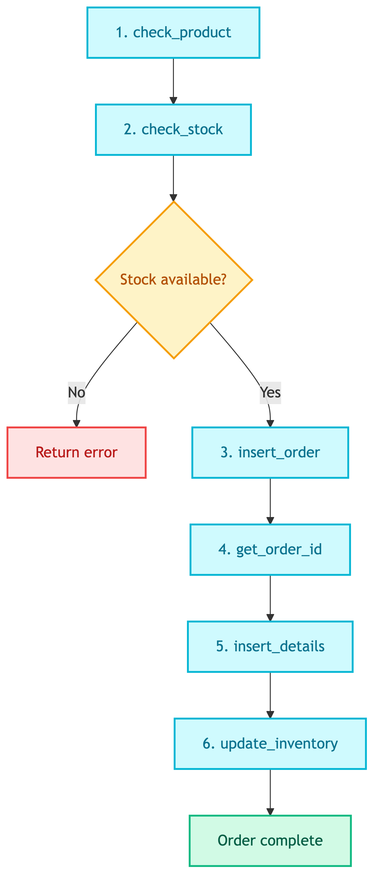

# **📦 Place Order SQL Prompt**

Generate SQL statements for placing customer orders.


---


## **📍 Location**

[`prompts/tools/customer/place_order_sql.prompt`](../../../../prompts/tools/customer/place_order_sql.prompt)


---


## **🏷️ Prompt Name**

`tools_customer_place_order_sql`


---


## **💡 Purpose**

Generate a sequence of SQL statements to:
1. Validate product and stock
2. Create order record
3. Add order details
4. Update inventory


---


## **📥 Input Variables**

| Variable | Description |
|----------|-------------|
| `product_id` | Product ID to order |
| `quantity` | Quantity to order |
| `customer_id` | Customer placing the order |
| `schema` | Database schema |
| `db_type` | sqlite or postgresql |


---


## **📤 Output Format**

JSON object with 6 SQL statements:

```json
{
  "check_product": "SELECT ... FROM Products WHERE product_id = X",
  "check_stock": "SELECT quantity as available, color FROM Inventory WHERE ...",
  "insert_order": "INSERT INTO Orders ...",
  "get_order_id": "SELECT last_insert_rowid() as order_id",
  "insert_details": "INSERT INTO OrderDetails ... VALUES (ORDER_ID_PLACEHOLDER, ...)",
  "update_inventory": "UPDATE Inventory SET quantity = quantity - X ..."
}
```


---


## **🔄 Flow**

<details>
<summary>📊 Flow</summary>



</details>


---


## **📝 Key Rules**

| Rule | Description |
|------|-------------|
| ORDER_ID_PLACEHOLDER | Use literal text, replaced by code later |
| Color handling | Get color from check_stock, use same color in insert_details |
| LIMIT 1 | Update only one inventory row |
| No ? placeholders | Use hardcoded values |


---


## **🗄️ Database Differences**

| Operation | SQLite | PostgreSQL |
|-----------|--------|------------|
| Timestamp | `datetime('now')` | `NOW()` |
| Get inserted ID | `last_insert_rowid()` | `RETURNING order_id` |
